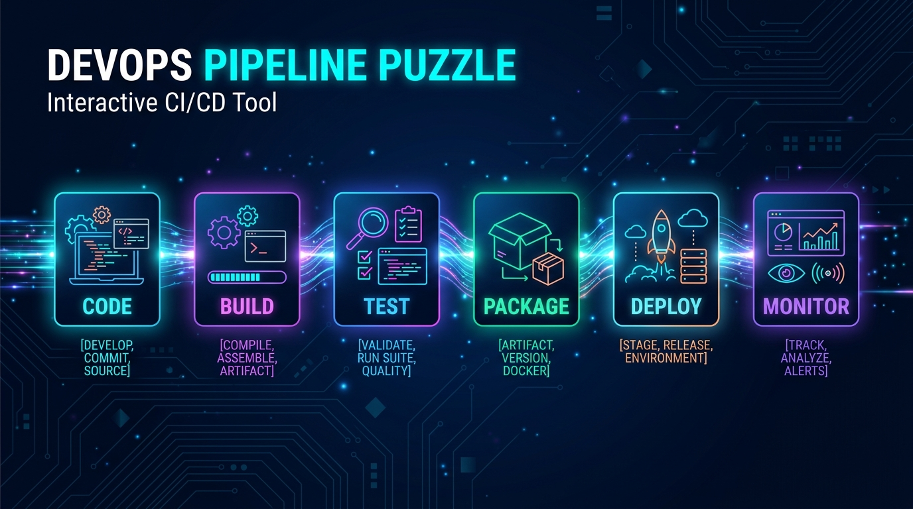
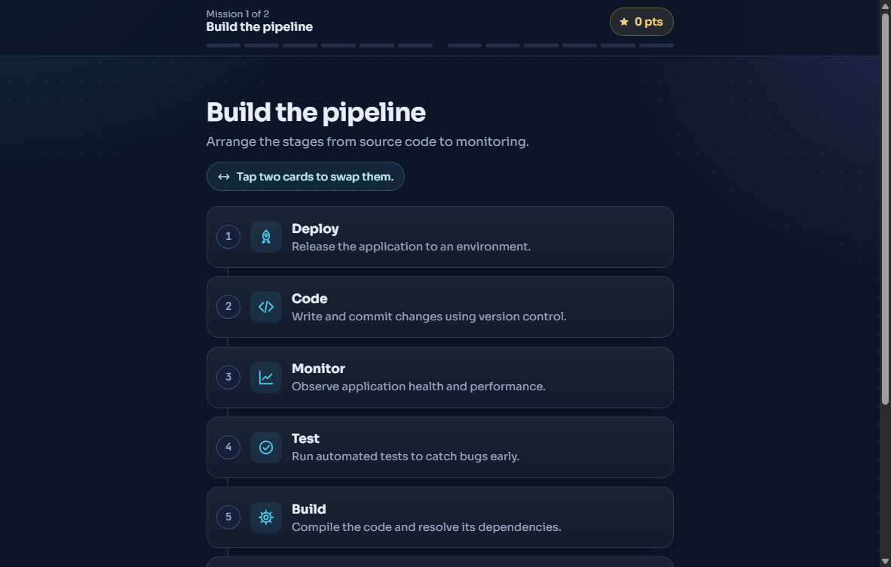
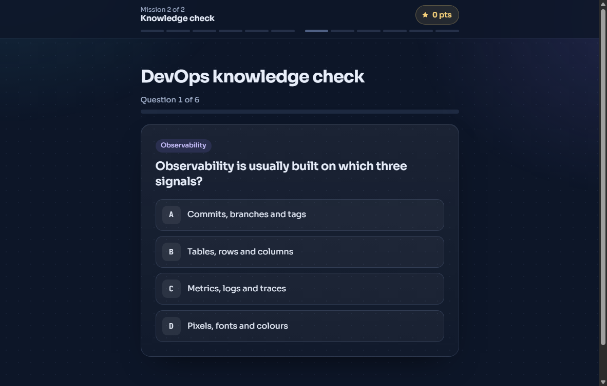
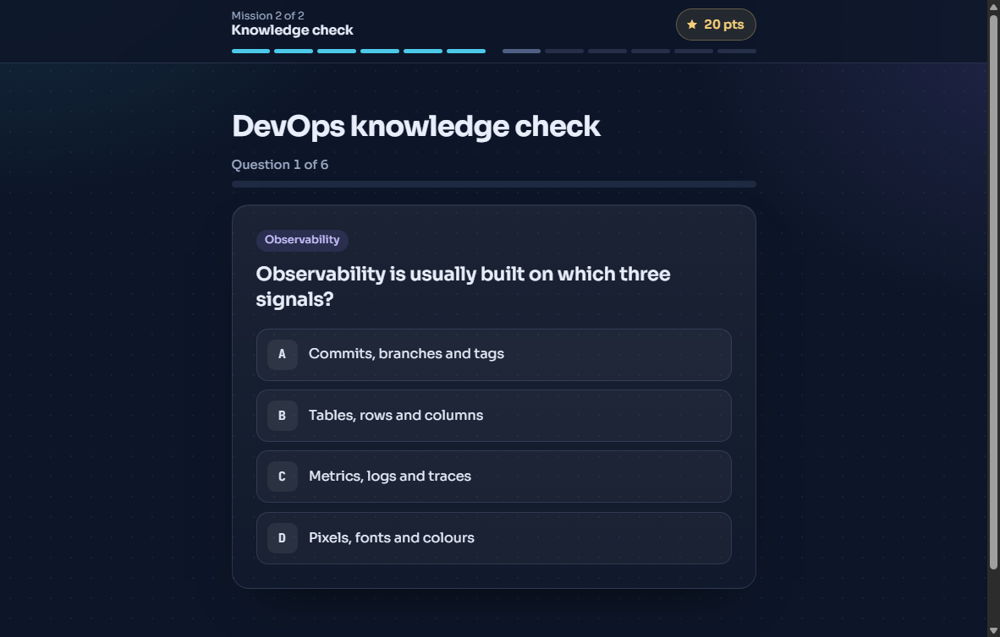
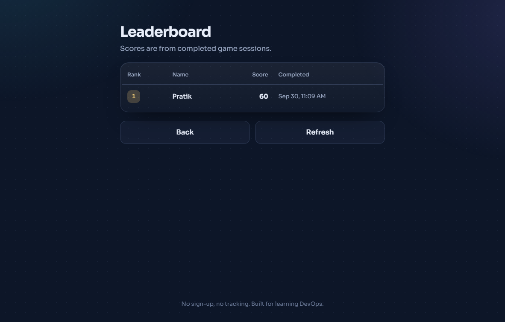

# 🚀 DevOps Pipeline Puzzle

> **Build it. Test it. Deploy it. Monitor it.**  
> A fast, interactive web game designed for workshops, college hackathons, and classroom activities to teach the DevOps lifecycle through hands-on gameplay.

[](https://render.com/deploy?repo=https://github.com/Pratikvatsh/devops-pipeline-puzzle)


---

<p align="center">
  
</p>

---

## 💡 Why this exists

Teaching CI/CD pipelines through slides usually puts people to sleep. 

**DevOps Pipeline Puzzle** turns the core concepts into a quick 5-minute competitive challenge. Players jump in from their phone or browser (no login or app installs needed), figure out the proper sequence of DevOps stages, test their knowledge with a rapid quiz, and fight for the top spot on the live leaderboard.

---

## 🎮 How the Game Works

```
[ CODE ] ➜ [ BUILD ] ➜ [ TEST ] ➜ [ PACKAGE ] ➜ [ DEPLOY ] ➜ [ MONITOR ]
```

### 1. Mission 1: Reconstruct the Pipeline
Cards arrive shuffled in random order. Players tap or drag cards to swap positions until they find the classic DevOps workflow. First-try solves score the highest points (20 pts), with hints provided if cards are out of order.

<p align="center">
  
</p>

### 2. Mission 2: Rapid DevOps Quiz
Once the pipeline passes, players face 6 randomized questions pulled from a bank of 16 DevOps scenarios (covering linting, containerization, staging environments, rollbacks, and observability). Each answer gives instant feedback with an explanation.

<p align="center">
  
</p>

### 3. Mission 3: Victory Card & Live Leaderboard
At the end, players receive a downloadable scorecard showing their percentage and game code, plus their standing on the community leaderboard.

<p align="center">
  
  &nbsp;
  
</p>

---

## 🛠️ Architecture & Under the Hood

We built this intentionally lean: zero front-end build tools, zero giant client bundles, and pure server-side authority.

- **Server-Authoritative Validation**: The browser never decides if an answer is right or calculates scores. Every swap verification and quiz answer is validated strictly in Node.js to keep things tamper-proof.
- **Dual Storage Modes**:
  - **In-Memory Store (Default for quick sessions)**: Set `USE_MEMORY_STORE=true` and run the entire game without setting up any external database.
  - **Supabase PostgreSQL**: Connect a free Supabase instance for persistent multi-day events and permanent leaderboards.
- **Refresh & Disconnect Safe**: Mid-game accidental refreshes automatically recover the session from local game state tokens.
- **Lightweight Vanilla UI**: Pure modern CSS variables, responsive mobile-first touch layout, and zero client dependencies.

---

## ⚡ Quick Start (Local Setup)

Requirements: [Node.js 18+](https://nodejs.org/) installed on your computer.

```bash
# 1. Clone the repository
git clone https://github.com/Pratikvatsh/devops-pipeline-puzzle.git
cd devops-pipeline-puzzle

# 2. Install dependencies
npm install

# 3. Configure local environment (runs in-memory by default)
cp .env.example .env

# 4. Start the server
npm start
```

Visit **`http://localhost:3000`** in your browser.

> **Want live auto-reload while editing code?** Run `npm run dev`.  
> **Run automated test suite:** Run `npm test` (all 8 API and game flow tests run offline).

---

## ☁️ Deploy in 1 Click (Render)

You can host this live for free on Render so everyone in your room can play:

[](https://render.com/deploy?repo=https://github.com/Pratikvatsh/devops-pipeline-puzzle)

1. Click the button above (or open [render.com/deploy](https://render.com/deploy?repo=https://github.com/Pratikvatsh/devops-pipeline-puzzle)).
2. Log in with your GitHub account.
3. Click **Apply** / **Create Web Service**.  
   Render will read `render.yaml`, install packages, and boot the web service.
4. Share the generated `https://<your-app>.onrender.com` link with your players!

*(The free tier boots in in-memory mode out of the box with zero external database credentials required.)*

---

## 🗄️ Optional: Connecting Supabase (Persistent Leaderboard)

If you want the leaderboard to persist across server restarts:

1. Create a free project at [supabase.com](https://supabase.com).
2. Go to **SQL Editor** → **New Query**, paste the contents of `supabase/schema.sql`, and hit **Run**.
3. In your project settings (Settings → API), grab your:
   - **Project URL**
   - **Service Role Secret Key** (`sb_secret_...`)
4. In your `.env` (or Render environment variables), set:
   ```env
   SUPABASE_URL=https://your-project.supabase.co
   SUPABASE_SERVICE_ROLE_KEY=sb_secret_your_key_here
   USE_MEMORY_STORE=false
   ```
5. Restart your server. The log will confirm `(store: supabase)`.

---

## 📂 Project Structure

```
devops-pipeline-puzzle/
├── public/                 # Client UI (no build step needed)
│   ├── index.html          # Semantic, accessible HTML5 layout
│   ├── styles.css          # Theme, responsive layout, animations
│   └── app.js              # State machine, DOM rendering, fetch calls
├── src/
│   ├── config.js           # Scoring rules & question thresholds
│   ├── controllers/        # Server validation & scoring logic
│   ├── data/               # Pipeline definitions & 16-question bank
│   ├── db/                 # Pluggable store (Memory vs. Supabase)
│   ├── routes/             # REST API endpoints (/api/game, /api/leaderboard)
│   └── utils/              # Cryptographic shuffle & HTTP error handling
├── docs/                   # Visuals and screenshots for documentation
├── supabase/
│   └── schema.sql          # PostgreSQL table definition with RLS
├── render.yaml             # 1-click cloud blueprint specification
└── tests/
    └── api.test.js         # Automated end-to-end game tests
```

---

## 🎯 Scoring System

| Milestone | Rules | Max Points |
| :--- | :--- | :--- |
| **Pipeline Puzzle** | 1st attempt: 20 pts &bull; 2nd attempt: 15 pts &bull; 3rd+ attempt: 10 pts | 20 pts |
| **Quiz Questions** | 6 questions randomly selected &bull; 10 pts per correct answer | 60 pts |
| **Total Possible** | | **80 pts (100%)** |

---

## 🤝 Contributing & Customizing

- **Add your own questions**: Edit `src/data/quizQuestions.js` with your topic-specific questions.
- **Change stage names or hints**: Modify `src/data/pipelineStages.js`.
- **Tweak scoring thresholds**: Adjust `src/config.js`.

---

## 📄 License

Distributed under the [MIT License](LICENSE). Built for students, engineers, and educators everywhere.
